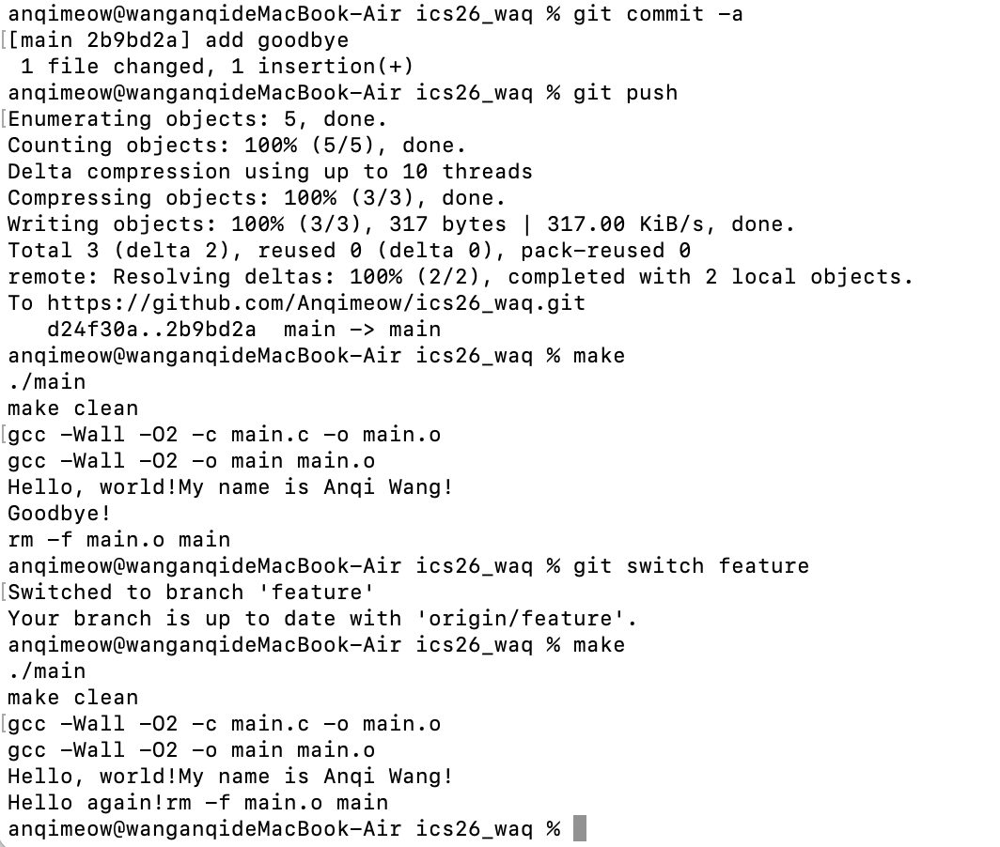
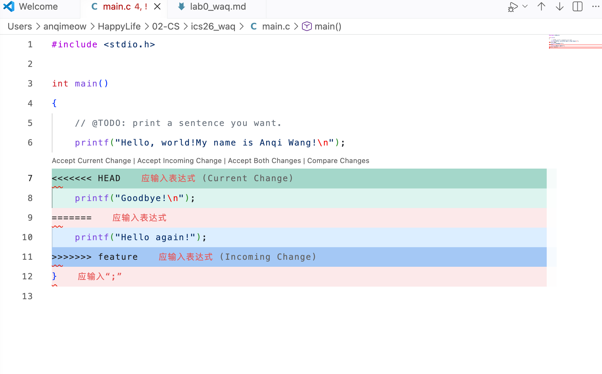
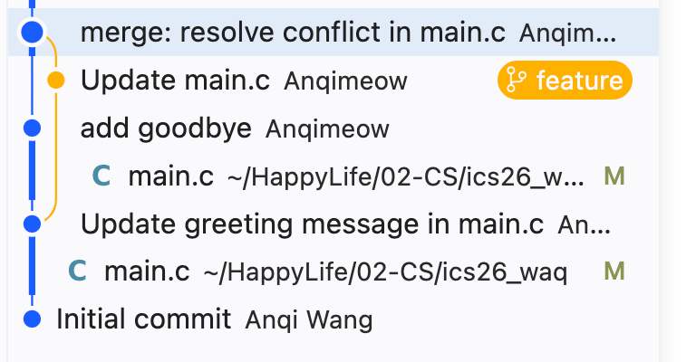

# Lab0 王安琪
## Part1. Q and A
### 1.你之前有过多人协同开发的经历吗？如果有，你们是使用什么方式分工协作的？
- 我有过多人协同开发的经历，用的就是git版本控制的协作方式。也就是拉去代码仓库，建立自己的分支，在自己的分支暂存-提交，然后提交PR，最后再merge到main分支上实现多人协同开发。

### 2.思考一下，Git 为什么要设计“暂存-提交”两个步骤？
- 我认为暂存区具有本次commit的预览功能。而commit本质是保存暂存区里所有文件的快照，是不可变的历史节点。

- 如果没有暂存区，只能一次性提交全部修改，无法拆分改动成多个逻辑独立的版本。

- git设计这两个步骤是为了把“选择进入下一次提交的改动”和“真正写入历史的改动”分开。从而精确控制提交内容，可支持部分与拆分提交，merge冲突解决也需要它。

### 3.git branch 和 git branch -a 的区别是什么？查阅资料并回答。
- git branch 只列出 本地分支 
- git branch -a 列出 本地分支和远程跟踪分支

---
## Part2. 我对“为什么要学习 Git”的理解
#### 我阅读了以下两个文章：Commit Message 规范、Git Flow 使用规范
##### Commit Message 规范：
- 本文章讲述了：
1.Commit message 的价值
规范的提交说明：① 方便快速浏览代码提交历史；② 可以按类型过滤提交记录；③ 能够自动生成版本变更日志 Change log。
2.Commit message 的格式
整体分为 Header（必填）、Body、Footer（后两者可选）。
3.一些配套工具：Commitizen、validate-commit-msg、conventional-changelog

- 我的理解：我认为 Git 不只是一个保存代码、备份文件的工具，学习 Git 本质是学会管理代码变更、多人协作、追踪项目演进。Git 的核心价值是版本追踪与多人协作；而学习 commit 规范，是用好 Git 的进阶习惯，让 Git 记录从一堆杂乱快照，变成一份清晰可读的项目档案。

##### Git Flow 使用规范：
- 本文章讲述了：Git Flow工作流程、关键分枝、实操示例、版本与命名规范
- 我的理解：Git 解决代码版本保存与多人协作问题；Gitflow 是在 Git 基础上，制定一套分支协作规则，让多人开发流程标准化，减少混乱。
Git 本质是分布式版本控制系统，学习 Git 不只是学几条 git 命令，核心价值体现在：代码版本回溯，防止代码丢失；可支撑多人团队协同开发（也是 Gitflow 存在的基础）（Git 靠分支机制，让开发者各自在独立分支开发功能，互不干扰；Gitflow 就是一套基于 Git 分支的协作规则）；清晰记录变更，方便代码追溯与复盘；通过灵活的发布管理，保障线上稳定（配合 Gitflow，借助分支 + tag 机制区分开发版、测试版、线上正式版）

---
## Part3. git分支操作

### 实验目标
学习 Git 分支管理，在 `feature` 分支和 `main` 分支上对 `main.c` 分别进行修改与提交，然后执行 merge 操作并处理发生的合并冲突。

### 实验过程

#### 第一步：在 main 分支上提交第一次修改
首先在 main 分支上修改 `main.c`，添加一个新的 printf 输出语句。



执行命令：
```bash
git add main.c
git commit -a -m "add goodbye"
git push
```

#### 第二步：在创建好的 feature 分支进行修改

#### 第三步：处理合并冲突
返回 main 分支并执行 merge 操作：



执行命令：
```bash
git switch main
git merge feature
```

此时 Git 自动检测到冲突，在 main.c 中出现了合并冲突标记：

**冲突产生的原因分析：**
- 在 `main` 分支上，修改了 `printf("Hello, world!My name is Anqi Wang!\n");` 这一行
- 在 `feature` 分支上，也修改了同一位置的代码（例如修改为 `printf("Goodbye!\n");`）
- 当 Git 尝试自动合并时，无法确定应该采用哪个版本的修改，因此产生了冲突

**冲突标记解释：**
```
<<<<<<< HEAD                          (当前分支 main 的修改)
printf("Hello, world!My name is Anqi Wang!\n");
=======                               (分界线)
printf("Goodbye!\n");                 (feature 分支的修改)
>>>>>>> feature
```

#### 第四步：解决冲突并完成合并
VS Code 提供了友好的冲突解决界面，显示：
- **HEAD（应用入表达式 Current Change）**：当前 main 分支的版本
- **feature（应用入表达式 Incoming Change）**：要合并的 feature 分支版本
- **分界线（=======）**：分隔两个版本



**冲突解决步骤：**
1. 手动选择接受当前更改、接收传入更改、或同时接受两个更改
2. 在本例中，我们同时接受了两个更改，最终代码为：
```c
printf("Hello, world!My name is Anqi Wang!\n");
printf("Goodbye!\n");
```
3. 保存修改后，执行：
```bash
git add main.c
git commit -m "merge: resolve conflict in main.c"
git push
```

### 实验心得

通过这次实验，我深刻理解了：

1. **为什么会产生合并冲突**：当两个分支在同一文件的同一位置进行了不同的修改时，Git 无法自动判断应该采用哪个版本，必须由开发者手动解决。

2. **分支的隔离性**：不同分支上的修改是独立的，这允许多个开发者同时在不同功能分支上工作，而不会互相影响。

3. **合并冲突的处理**：
   - Git 用特殊标记（`<<<<<<<`、`=======`、`>>>>>>>`）来标识冲突位置
   - VS Code 等工具提供了友好的冲突解决界面
   - 解决冲突后需要重新提交，这个提交会清晰地记录在历史中

4. **Git 工作流的完整性**：分支创建 → 独立开发 → 合并 → 冲突解决 → 提交推送，这个完整的工作流支撑了团队协同开发。


